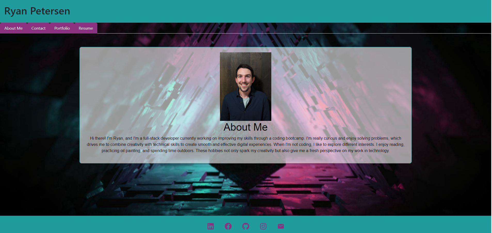

# Ryan's Portfolio

Welcome to my digital portfolio! This single-page application is a window into my world as an aspiring web developer, showcasing my growth and achievements. Crafted with cutting-edge technologies, this site not only introduces you to my professional journey but also serves as a testament to my technical prowess.

  - Gracing the top of the page is my name, accompanied by a sleek, responsive navigation bar. This intuitive menu adapts seamlessly to various screen sizes, guiding you effortlessly through the About Me, Portfolio, Contact, and Resume sections. As you explore, the menu cleverly highlights your current location within the site.

  - Navigate through the different sections with ease as each one unfolds below upon selection. Watch as the URL dynamically updates to reflect your current view.

  - Dive into a curated collection of my projects, each one brought to life with a representative image. Curious to see more? Direct links to both the live applications and their GitHub repositories are just a click away.

  - Feeling inspired to connect? I've implemented a user-friendly contact form, making it a breeze to reach out and start a conversation.

  - Venture into the resume section to discover a comprehensive overview of my technical toolkit and areas of expertise.

  - At the bottom of the page, you'll find my digital calling card - a footer housing direct links to my GitHub, LinkedIn, Stack Overflow profiles, and email. Choose your preferred platform and let's connect!

## Installation

To install Kaila's Portfolio:

- Clone the repository: `https://github.com/girlnotfound/Kaila-Portfolio`

- Navigate to the project directory

- Open the terminal and install the dependencies by running the command: `npm install`

## Usage

- Start the application, in the terminal run the command: `npm start`

- You will be redirected to the application: `http://localhost:3000/`

[Link to Deployed Portfolio](https://ryans-portfolio.netlify.app)

## Credits

This project was made possible with the help of:

[Adam Rosenberg](https://github.com/AcoderRose)

[Ryan Petersen](https://github.com/RyanPetersen-89)